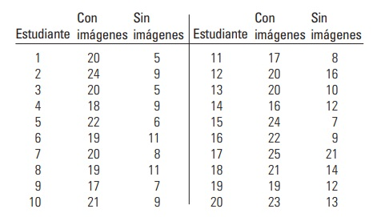

```{r setup, include=FALSE}
knitr::opts_chunk$set(echo = FALSE)
```


## Distribución muestral de la diferencia de medias

## Distribución muestral de la diferencia de medias.

Es el conjunto de las diferencias de las medias de todas las muestras posibles de determinado tamaño n y m respectivamente,  que es posible obtener de una determinada población.


## Distribución de las diferencias de medias.


Dichas diferencias se ditribuyen de acuerdo a los supuestos que cumplen y se encuentran resumidas en la siguientes tablas:

##

| Supuestos          | Estandarizada    | 
|-------------------|-------------|
| Si $n_{1}> 30$ y $n_{2}> 30$ y  $\sigma_{1}$ y $\sigma_{2}$ conocidos.  | $z=\frac{(\overline{X_{1}}-\overline{X_{2}})-(\mu_{1} -\mu_{2}) }{\sqrt{\frac{\sigma_{1}^{2}}{n_{1}}+ \frac{\sigma_{2}^{2}}{n_{2}}}}$   | 
|-------------------|-------------|
| Si $n_{1}> 30$ y $n_{2}>30$ y  $\sigma_{1}$ y $\sigma_{2}$ desconocidos. Se aproxima $\sigma_{1}\approx s_{1}$ y $\sigma_{2}\approx s_{2}$ | $z=\frac{(\overline{X_{1}}-\overline{X_{2}})-(\mu_{1} -\mu_{2}) }{\sqrt{\frac{s_{1}^{2}}{n_{1}}+ \frac{s_{2}^{2}}{n_{2}}}}.$              |
 

 


##

| Supuestos          | Estandarizada    | 
|-------------------|-------------|
| Si $n_{1}\leq 30$ y $n_{2}\leq 30$ y  $\sigma_{1}$ y $\sigma_{2}$ desconocidos. Además se supone $\sigma_{1}=\sigma_{2}.$ **(HOMOCEDASTICAS)**. Se aproxima $\sigma_{1}\approx s_{1}$ y $\sigma_{2}\approx s_{2}$           |  $t=\frac{(\overline{X_{1}}-\overline{X_{2}})-(\mu_{1} -\mu_{2}) }{S_{p}\sqrt{\frac{1}{n_{1}}+ \frac{1}{n_{2}}}}.$      Con $GL=n_{1} +n_{2} - 2$  y $S_{p}^{2}= \frac{(n_{1}-1)s_{1}^{2} + (n_{2}-1)s_{2}^{2}}{n_{1} + n_{2} -2}$ 
| 
|Si $n_{1}\leq 30$ y $n_{2}\leq 30$ y  $\sigma_{1}$ y $\sigma_{2}$ desconocidos. Además se supone $\sigma_{1}\not =\sigma_{2}.$ **(HETEROCEDASTICAS)**. Se aproxima $\sigma_{1}\approx s_{1}$ y $\sigma_{2}\approx s_{2}$              | $t=\frac{(\overline{X_{1}}-\overline{X_{2}})-(\mu_{1} -\mu_{2}) }{\sqrt{\frac{s_{1}^{2}}{n_{1}}+ \frac{s_{2}^{2}}{n_{2}}}}$. Con GL grados de libertad y $GL=\frac{\left(\frac{s_{1}^{2}}{n_{1}} + \frac{s_{2}^{2}}{n_{2}} )\right)^{2}}{\frac{(s_{1}^{2}/n_{1})^{2}}{n_{1}-1}+\frac{(s_{2}^{2}/n_{2})^{2}}{n_{2}-1}}$ | 

##

| Supuestos          | Estandarizada    | 
|-------------------|-------------|
|Para muestras pareadas o relacionadas| $t=\frac{\overline{d} - (\mu_{1} -\mu_{2})}{\frac{s_{d}}{\sqrt{n}}}.$ Con $n-1$ grados de libertad. $\overline{d}$ es el promedio de las diferencias y $s_{d}$ la desviación estándar de las diferencias |


## Ejercicio 1.

En la ciudad de Tunja para niños de cuarto grado se tiene un peso medio de 35 kg convarianza de 5 kg, mientras que en la ciudad de Cartagena para niños de cuarto grado se tiene un peso medio de 45 kg con una varianza de 8 kg. Se toma una muestra aleatoria en Bogota de 50 niños de cuarto grado y una muestra aleatoria en Cartagena de 60 niños de cuarto grado.

+ ¿Cuál es la probabilidad de que la media muestral del peso de los niños de Cartagena difiera de la media muestral del peso de los niños de Tunja de cuarto grado en más de 10.5 kg?.

+ ¿Cuál es la probabilidad de que la diferencia absoluta de las medias muestrales sea de por lo menos 10.2 kg?

## Ejercicio 2.

Los resultados en el control de calidad de dos productos son los siguientes:

*Producto 1:* 1.6, 2.6, 3.6 y 2.6.

*Producto 2:* 2.6, 3.1, 3.1, 4.1, 3.6 y 2.1.

+ ¿Cuál es la probabilidad de que la media muestral 1 difiera de la media muestral 2 como máximo en -0.7?

+ ¿Cuál es la probabilidad de que la media muestral 1, difiera de la media muestral 2 en más de 0.88?

## Ejercicio 3.

Experimentos de memoria Un grupo de psicología realizó un experimento para comparar si una calificación de recordatorio, en la que se dieron instrucciones para formar imágenes de 25 palabras,
es mejor que una calificación inicial de recordatorio para la cual no se dieron instrucciones para formar imágenes. Veinte estudiantes participaron en el experimento con los resultados siguientes:

<center>


</center>


## 

+ ¿Cuál es la probabilidad de que la media muestral 1 difiera de la media muestral 2 como máximo en 2 puntos?

